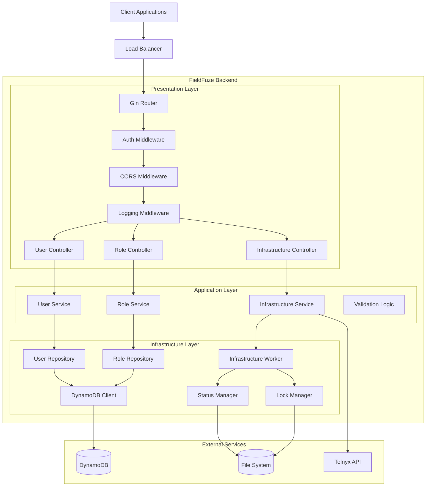
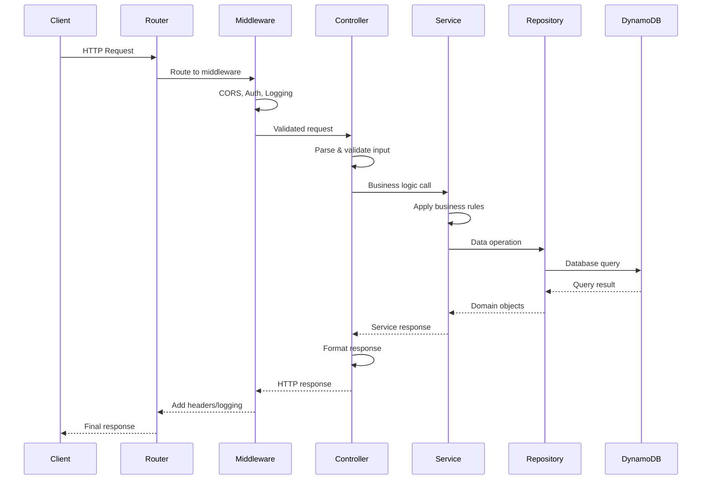
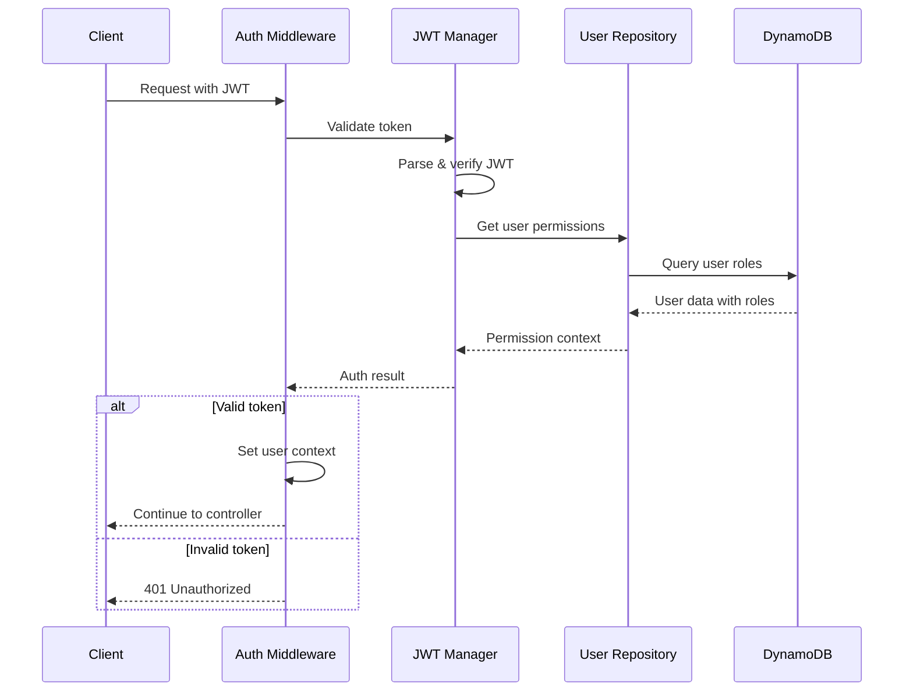
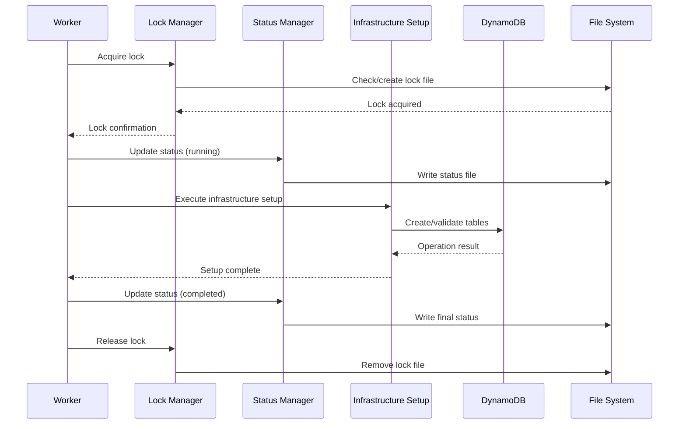

# Architecture Overview

This document provides a comprehensive overview of the FieldFuze Backend architecture, design patterns, and system components.

## 📋 Table of Contents

- [System Architecture](#system-architecture)
- [Layered Architecture](#layered-architecture)
- [Component Diagram](#component-diagram)
- [Data Flow](#data-flow)
- [Security Architecture](#security-architecture)
- [Scalability Design](#scalability-design)
- [Technology Stack](#technology-stack)
- [Design Patterns](#design-patterns)

## System Architecture

FieldFuze Backend follows a **Clean Architecture** pattern with clear separation of concerns, dependency inversion, and high testability.

```
┌─────────────────────────────────────────────────────────┐
│                     Presentation Layer                  │
│  ┌─────────────┐  ┌─────────────┐  ┌─────────────┐     │
│  │ REST API    │  │ Swagger UI  │  │ Middleware  │     │
│  │ Controllers │  │ Documentation│  │ (CORS, Auth)│     │
│  └─────────────┘  └─────────────┘  └─────────────┘     │
└─────────────────────────────────────────────────────────┘
                              │
                              ▼
┌─────────────────────────────────────────────────────────┐
│                    Application Layer                    │
│  ┌─────────────┐  ┌─────────────┐  ┌─────────────┐     │
│  │ Services    │  │ Business    │  │ Validation  │     │
│  │ (Business   │  │ Logic       │  │ Rules       │     │
│  │ Logic)      │  │             │  │             │     │
│  └─────────────┘  └─────────────┘  └─────────────┘     │
└─────────────────────────────────────────────────────────┘
                              │
                              ▼
┌─────────────────────────────────────────────────────────┐
│                   Infrastructure Layer                  │
│  ┌─────────────┐  ┌─────────────┐  ┌─────────────┐     │
│  │ Repository  │  │ DynamoDB    │  │ Workers     │     │
│  │ (Data       │  │ Client      │  │ (Background │     │
│  │ Access)     │  │             │  │ Jobs)       │     │
│  └─────────────┘  └─────────────┘  └─────────────┘     │
└─────────────────────────────────────────────────────────┘
                              │
                              ▼
┌─────────────────────────────────────────────────────────┐
│                     External Services                   │
│  ┌─────────────┐  ┌─────────────┐  ┌─────────────┐     │
│  │ AWS         │  │ Telnyx      │  │ File System │     │
│  │ DynamoDB    │  │ API         │  │ (Logs,      │     │
│  │             │  │             │  │ Status)     │     │
│  └─────────────┘  └─────────────┘  └─────────────┘     │
└─────────────────────────────────────────────────────────┘
```

## Layered Architecture

### 1. Presentation Layer

**Responsibilities:**
- HTTP request/response handling
- Input validation and serialization
- Authentication and authorization
- API documentation

**Components:**
- **Controllers**: Handle HTTP requests and delegate to services
- **Middleware**: Cross-cutting concerns (auth, CORS, logging)
- **Models**: Request/response DTOs
- **Swagger**: API documentation and testing interface

### 2. Application Layer

**Responsibilities:**
- Business logic implementation
- Use case orchestration
- Data transformation
- Transaction management

**Components:**
- **Services**: Business logic implementation
- **Validation**: Business rule validation
- **Orchestration**: Multi-step operations

### 3. Infrastructure Layer

**Responsibilities:**
- Data persistence
- External service integration
- System utilities
- Background processing

**Components:**
- **Repository**: Data access abstraction
- **DAL (Data Access Layer)**: Database client management
- **Workers**: Background job processing
- **Utilities**: Helper functions and tools

## Component Diagram



## Data Flow

### 1. Request Processing Flow



### 2. Authentication Flow



### 3. Worker Process Flow



## Security Architecture

### 1. Authentication & Authorization

```
┌─────────────────────────────────────────────────────────┐
│                    Security Layers                      │
│                                                         │
│  ┌─────────────┐    ┌─────────────┐    ┌─────────────┐ │
│  │   Client    │    │     API     │    │  Database   │ │
│  │ Application │────│   Gateway   │────│   Security  │ │
│  │  Security   │    │  Security   │    │             │ │
│  └─────────────┘    └─────────────┘    └─────────────┘ │
│        │                   │                   │       │
│        ▼                   ▼                   ▼       │
│  ┌─────────────┐    ┌─────────────┐    ┌─────────────┐ │
│  │ JWT Tokens  │    │ CORS Policy │    │ IAM Roles   │ │
│  │ HTTPS Only  │    │ Rate Limit  │    │ VPC Config  │ │
│  │ Secure      │    │ Input Val.  │    │ Encryption  │ │
│  │ Storage     │    │ Auth Checks │    │ at Rest     │ │
│  └─────────────┘    └─────────────┘    └─────────────┘ │
└─────────────────────────────────────────────────────────┘
```

### 2. Permission Model

```
Permission Hierarchy (8 Levels):
┌─────────────────────────────────────────┐
│ Level 8: admin (Full Access)            │ ← Highest
├─────────────────────────────────────────┤
│ Level 7: manage (Create/Update/Delete)  │
├─────────────────────────────────────────┤
│ Level 6: delete (Delete Operations)     │
├─────────────────────────────────────────┤
│ Level 5: update (PUT Operations)        │
├─────────────────────────────────────────┤
│ Level 4: create (POST Operations)       │
├─────────────────────────────────────────┤
│ Level 3: write (PATCH Operations)       │
├─────────────────────────────────────────┤
│ Level 2: read (GET Operations)          │
├─────────────────────────────────────────┤
│ Level 1: view (Read-only Reports)       │ ← Lowest
└─────────────────────────────────────────┘
```

### 3. Security Features

- **JWT Authentication**: Stateless token-based authentication
- **Role-Based Access Control**: Fine-grained permission system
- **Password Security**: Bcrypt hashing with salt
- **Input Validation**: Comprehensive input sanitization
- **CORS Protection**: Configurable cross-origin policies
- **Rate Limiting**: Request throttling and abuse prevention
- **Audit Logging**: Security event logging and monitoring

## Scalability Design

### 1. Horizontal Scaling

```
┌─────────────────────────────────────────────────────────┐
│                    Load Balancer                        │
│                 (ALB/NGINX/HAProxy)                     │
└─────────────────────┬───────────────────────────────────┘
                      │
        ┌─────────────┼─────────────┐
        │             │             │
        ▼             ▼             ▼
┌─────────────┐ ┌─────────────┐ ┌─────────────┐
│ FieldFuze   │ │ FieldFuze   │ │ FieldFuze   │
│ Instance 1  │ │ Instance 2  │ │ Instance N  │
│             │ │             │ │             │
└─────────────┘ └─────────────┘ └─────────────┘
        │             │             │
        └─────────────┼─────────────┘
                      │
                      ▼
              ┌─────────────┐
              │  DynamoDB   │
              │ (Shared)    │
              └─────────────┘
```

### 2. Performance Optimizations

- **Concurrent Processing**: Goroutines for parallel operations
- **Connection Pooling**: Efficient database connection management
- **Caching**: In-memory permission and session caching
- **Async Operations**: Background worker processing
- **Stateless Design**: No server-side session storage

### 3. Monitoring & Observability

```
┌─────────────────────────────────────────────────────────┐
│                   Observability Stack                   │
│                                                         │
│  ┌─────────────┐  ┌─────────────┐  ┌─────────────┐     │
│  │   Metrics   │  │   Logging   │  │   Tracing   │     │
│  │             │  │             │  │             │     │
│  │ • Response  │  │ • Structured│  │ • Request   │     │
│  │   Times     │  │   Logs      │  │   Tracking  │     │
│  │ • Error     │  │ • Error     │  │ • Distributed│     │
│  │   Rates     │  │   Events    │  │   Tracing   │     │
│  │ • Throughput│  │ • Audit     │  │ • Performance│     │
│  │             │  │   Trail     │  │   Profiling │     │
│  └─────────────┘  └─────────────┘  └─────────────┘     │
└─────────────────────────────────────────────────────────┘
```

## Technology Stack

### Core Technologies

| Component | Technology | Version | Purpose |
|-----------|------------|---------|---------|
| **Runtime** | Go | 1.23.2 | Primary programming language |
| **Web Framework** | Gin | 1.10.1 | HTTP server and routing |
| **Database** | AWS DynamoDB | - | NoSQL document database |
| **Authentication** | JWT | 5.3.0 | Token-based authentication |
| **Logging** | Logrus | 1.9.3 | Structured logging |
| **Configuration** | Viper | 1.21.0 | Configuration management |
| **Validation** | Validator | 10.20.0 | Input validation |
| **Documentation** | Swagger | 1.16.6 | API documentation |

### AWS Services

| Service | Purpose | Features Used |
|---------|---------|---------------|
| **DynamoDB** | Primary database | Tables, GSI, Auto-scaling |
| **IAM** | Access control | Roles, Policies |
| **CloudWatch** | Monitoring | Logs, Metrics, Alarms |
| **VPC** | Network security | Subnets, Security Groups |

### Development Tools

| Tool | Purpose | Configuration |
|------|---------|---------------|
| **Git** | Version control | Branching strategy |
| **Docker** | Containerization | Multi-stage builds |
| **Make** | Build automation | Build targets |
| **golangci-lint** | Code quality | Linting rules |

## Design Patterns

### 1. Repository Pattern

```go
// Repository interface for data access abstraction
type UserRepository interface {
    CreateUser(ctx context.Context, user *User) (*User, error)
    GetUser(userID string) ([]*User, error)
    UpdateUser(userID string, updates *User) (*User, error)
    DeleteUser(userID string) error
}

// Implementation provides concrete data access
type DynamoUserRepository struct {
    client   *dynamodb.Client
    tableName string
}
```

### 2. Dependency Injection

```go
// Constructor pattern for dependency injection
func NewController(ctx context.Context, cfg *Config, log logger.Logger) *Controller {
    // Create dependencies
    dbClient := dal.NewDynamoDBClient(cfg, log)
    userRepo := repository.NewUserRepository(dbClient, cfg, log)
    jwtManager := middleware.NewJWTManager(cfg, log, userRepo)
    
    // Inject dependencies
    return &Controller{
        User: NewUserController(ctx, userRepo, log, jwtManager),
        Role: NewRoleController(ctx, roleService, log),
    }
}
```

### 3. Middleware Pattern

```go
// Middleware chain for cross-cutting concerns
r.Use(corsMiddleware.CORS())
r.Use(loggingMiddleware.StructuredLogger())
r.Use(loggingMiddleware.Recovery())

// Route-specific middleware
user.GET("/:id", 
    jwtManager.AuthMiddleware(),
    jwtManager.RequireResourcePermission("user_details"),
    controller.GetUser)
```

### 4. Strategy Pattern

```go
// Permission evaluation strategies
type PermissionStrategy interface {
    Evaluate(user *User, resource string, action string) bool
}

type RoleBasedStrategy struct{}
type ContextBasedStrategy struct{}
type OwnershipBasedStrategy struct{}
```

### 5. Factory Pattern

```go
// Service factory for creating configured services
type ServiceFactory struct {
    config *Config
    logger logger.Logger
}

func (f *ServiceFactory) CreateUserService() *UserService {
    repo := f.createUserRepository()
    return NewUserService(repo, f.logger)
}
```

### 6. Observer Pattern

```go
// Event-driven architecture for notifications
type EventPublisher interface {
    Publish(event string, data interface{}) error
    Subscribe(event string, handler EventHandler) error
}

// Usage: Publish user creation events
publisher.Publish("user.created", &UserCreatedEvent{
    UserID: user.ID,
    Email:  user.Email,
})
```

### 7. Circuit Breaker Pattern

```go
// Resilience pattern for external service calls
type CircuitBreaker struct {
    threshold    int
    timeout      time.Duration
    state        State
    failureCount int
}

func (cb *CircuitBreaker) Call(fn func() error) error {
    if cb.state == Open {
        return ErrCircuitOpen
    }
    // Implementation...
}
```

---

**Related Documentation**: [Controllers](CONTROLLERS.md) | [Services](SERVICES.md) | [Security](SECURITY.md) | [Deployment](DEPLOYMENT.md)