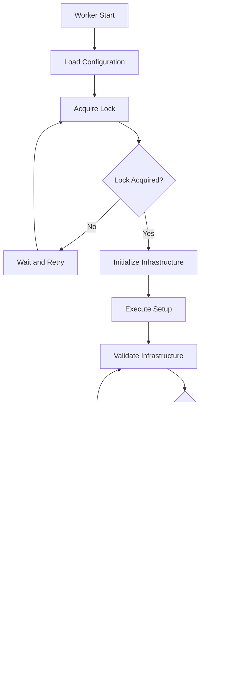

# Workers

The Workers layer handles background jobs and infrastructure automation. The primary worker is the Infrastructure Worker, which manages DynamoDB table creation, validation, and maintenance.

## 📋 Table of Contents

- [Overview](#overview)
- [Infrastructure Worker](#infrastructure-worker)
- [Worker Architecture](#worker-architecture)
- [Status Management](#status-management)
- [Lock Management](#lock-management)
- [Adding New Workers](#adding-new-workers)
- [Monitoring and Health](#monitoring-and-health)
- [Best Practices](#best-practices)

## Overview

The Worker system in FieldFuze provides:
- **Infrastructure Automation**: Automated DynamoDB table and index creation
- **Background Processing**: Cron-based job scheduling
- **Distributed Locking**: Prevent multiple worker instances from conflicting
- **Status Tracking**: Real-time status and progress monitoring
- **Health Monitoring**: Worker health checks and auto-restart capabilities
- **Error Recovery**: Retry mechanisms and graceful error handling

## Infrastructure Worker

The Infrastructure Worker is the main background service responsible for managing AWS DynamoDB infrastructure.

### Key Features
- **Automated Table Creation**: Creates and configures DynamoDB tables
- **Index Management**: Sets up and validates Global Secondary Indexes
- **Health Validation**: Continuous infrastructure health monitoring
- **Self-Healing**: Automatic detection and resolution of infrastructure issues
- **Environment Isolation**: Separate infrastructure per environment

### Worker Lifecycle



## Worker Architecture

### Worker Structure

**File**: `worker/worker.go:17-20`

```go
type Worker struct {
    Worker *models.Worker // Use pointer to avoid copying mutex
}
```

### Models Worker Structure

**File**: `models/worker.go:32-53`

```go
type Worker struct {
    Config              *Config
    Logger              logger.Logger
    CronJob             *cron.Cron
    LockManager         *LockManager
    StatusManager       *StatusManager
    InfrastructureSetup *InfrastructureSetup
    
    // Worker configuration
    WorkerConfig *WorkerConfig
    OwnerID      string
    IsRunning    bool
    StopChan     chan struct{}
    
    // Synchronization and state management
    Mu        sync.RWMutex
    Ctx       context.Context
    Cancel    context.CancelFunc
    SetupOnce sync.Once
    StopOnce  sync.Once
}
```

### Worker Initialization

**File**: `worker/worker.go:22-93`

```go
func NewWorker(ctx context.Context, cfg *models.Config, log logger.Logger) (*models.Worker, error) {
    if cfg == nil {
        return nil, fmt.Errorf("config cannot be nil")
    }
    if log == nil {
        return nil, fmt.Errorf("logger cannot be nil")
    }
    
    // Generate unique owner ID for this instance
    hostname := os.Getenv("HOSTNAME")
    if hostname == "" {
        hostname = "localhost"
    }
    
    ownerID := fmt.Sprintf("worker-%s-%s", hostname, uuid.New().String()[:8])
    
    // Create worker configuration
    workerConfig := &models.WorkerConfig{
        CronSchedule:      getCronScheduleForEnvironment(cfg.AppEnv),
        LockTimeout:       30 * time.Minute,
        LockRetryInterval: 5 * time.Second,
        MaxRetries:        5,
        RetryDelay:        2 * time.Second,
        BackoffMultiplier: 2.0,
        Environment:       cfg.AppEnv,
        RequiredTables:    []string{"users"},
        LockFilePath:      fmt.Sprintf("/tmp/fieldfuze-infrastructure-%s.lock", cfg.AppEnv),
        StatusFilePath:    fmt.Sprintf("/tmp/fieldfuze-status-%s.json", cfg.AppEnv),
        DryRun:            os.Getenv("INFRASTRUCTURE_DRY_RUN") == "true",
        SkipValidation:    os.Getenv("INFRASTRUCTURE_SKIP_VALIDATION") == "true",
        ForceRecreate:     os.Getenv("INFRASTRUCTURE_FORCE_RECREATE") == "true",
        RunOnce:           true,
    }
    
    // Initialize components
    lockManager := NewLockManager(workerConfig.LockFilePath, workerConfig.LockTimeout, workerConfig.Environment)
    statusManager := NewStatusManager(workerConfig.StatusFilePath)
    
    // Create infrastructure setup handler
    infrastructureSetup, err := NewInfrastructureSetup(cfg, log)
    if err != nil {
        return nil, fmt.Errorf("failed to create infrastructure setup: %w", err)
    }
    
    // Create cron job
    cronJob := cron.New()
    
    // Create context with cancellation
    ctx, cancel := context.WithCancel(context.Background())
    
    return &models.Worker{
        Config:              cfg,
        Logger:              log,
        CronJob:             cronJob,
        LockManager:         lockManager,
        StatusManager:       statusManager.ToModelsStatusManager(),
        InfrastructureSetup: infrastructureSetup.ToModelsInfrastructureSetup(),
        WorkerConfig:        workerConfig,
        OwnerID:             ownerID,
        StopChan:            make(chan struct{}),
        Ctx:                 ctx,
        Cancel:              cancel,
    }, nil
}
```

### Worker Configuration

**File**: `models/worker.go:62-93`

```go
type WorkerConfig struct {
    // Cron schedule
    CronSchedule string `json:"cron_schedule"`
    
    // Lock settings
    LockTimeout       time.Duration `json:"lock_timeout"`
    LockRetryInterval time.Duration `json:"lock_retry_interval"`
    
    // Retry settings
    MaxRetries        int           `json:"max_retries"`
    RetryDelay        time.Duration `json:"retry_delay"`
    BackoffMultiplier float64       `json:"backoff_multiplier"`
    
    // Environment settings
    Environment    string   `json:"environment"`
    RequiredTables []string `json:"required_tables"`
    
    // Paths
    LockFilePath   string `json:"lock_file_path"`
    StatusFilePath string `json:"status_file_path"`
    
    // Feature flags
    DryRun         bool `json:"dry_run"`
    SkipValidation bool `json:"skip_validation"`
    ForceRecreate  bool `json:"force_recreate"`
    RunOnce        bool `json:"run_once"`
    
    // Deletion flags
    DeletionScheduled bool `json:"deletion_scheduled"`
    DeletionRequested bool `json:"deletion_requested"`
}
```

## Infrastructure Setup

### Infrastructure Setup Handler

**File**: `worker/infrastructure.go:19-43`

```go
type InfrastructureSetup struct {
    InfrastructureSetup models.InfrastructureSetup
}

func NewInfrastructureSetup(cfg *models.Config, log logger.Logger) (*InfrastructureSetup, error) {
    // Create DynamoDB client
    dbClient, err := dal.NewDynamoDBClient(cfg, log)
    if err != nil {
        return nil, fmt.Errorf("failed to create DynamoDB client: %w", err)
    }
    
    return &InfrastructureSetup{
        InfrastructureSetup: models.InfrastructureSetup{
            Config:   cfg,
            Logger:   log,
            DBClient: dbClient,
        },
    }, nil
}
```

### Execution Flow

**File**: `worker/infrastructure.go:45-100`

```go
func (is *InfrastructureSetup) Execute(ctx context.Context, statusManager *StatusManager) error {
    is.InfrastructureSetup.Logger.Info("Starting infrastructure setup...")
    
    if err := statusManager.UpdateProgress(models.StatusRunning, "Starting infrastructure setup", nil); err != nil {
        return fmt.Errorf("failed to update status: %w", err)
    }
    
    tableDetails := is.getTableDetails()
    
    // Check if all tables already exist and are active
    allTablesExist := true
    var existingTables []string
    
    for _, tableInfo := range tableDetails {
        exists, err := is.tableExists(tableInfo.Name)
        if err != nil {
            is.InfrastructureSetup.Logger.Errorf("Failed to check if table %s exists: %v", tableInfo.Name, err)
            allTablesExist = false
            break
        }
        
        if exists {
            existingTables = append(existingTables, tableInfo.Name)
            statusManager.AddTableCreated(tableInfo.Name)
        } else {
            allTablesExist = false
        }
    }
    
    // If all tables exist, validate and handle accordingly
    if allTablesExist {
        is.InfrastructureSetup.Logger.Info("All required tables already exist, validating infrastructure...")
        
        if err := is.validateInfrastructure(ctx, tableDetails); err != nil {
            is.InfrastructureSetup.Logger.Errorf("Infrastructure validation failed: %v", err)
            
            // Handle validation failure - attempt to fix or recreate
            if err := is.handleValidationFailure(ctx, tableDetails, statusManager, err); err != nil {
                is.InfrastructureSetup.Logger.Errorf("Failed to handle validation failure: %v", err)
                statusManager.MarkFailed(fmt.Sprintf("Infrastructure validation failed and could not be fixed: %v", err))
                return err
            }
            
            // After handling failure, re-validate to ensure it's fixed
            if err := is.validateInfrastructure(ctx, tableDetails); err != nil {
                is.InfrastructureSetup.Logger.Errorf("Infrastructure still invalid after fix attempt: %v", err)
                statusManager.MarkFailed(fmt.Sprintf("Infrastructure validation failed after fix attempt: %v", err))
                return err
            }
            
            is.InfrastructureSetup.Logger.Info("✅ Infrastructure validation issues resolved successfully")
        } else {
            is.InfrastructureSetup.Logger.Info("✅ Infrastructure already exists and is valid")
        }
        
        // Mark as completed
        statusManager.MarkCompleted("Infrastructure validation completed successfully")
        return nil
    }
    
    // Create missing tables
    return is.createMissingTables(ctx, tableDetails, statusManager)
}
```

### Table Creation Process

```go
func (is *InfrastructureSetup) createMissingTables(ctx context.Context, tableDetails []TableInfo, statusManager *StatusManager) error {
    for _, tableInfo := range tableDetails {
        exists, err := is.tableExists(tableInfo.Name)
        if err != nil {
            return fmt.Errorf("failed to check if table exists: %w", err)
        }
        
        if !exists {
            is.Logger.Infof("Creating table: %s", tableInfo.Name)
            
            // Update status to creating tables
            if err := statusManager.UpdateProgress(models.StatusCreatingTables, 
                fmt.Sprintf("Creating table: %s", tableInfo.Name), nil); err != nil {
                return fmt.Errorf("failed to update status: %w", err)
            }
            
            // Create the table
            if err := is.createTable(ctx, &tableInfo); err != nil {
                return fmt.Errorf("failed to create table %s: %w", tableInfo.Name, err)
            }
            
            // Add to status
            statusManager.AddTableCreated(tableInfo.Name)
        }
    }
    
    // Wait for all tables to become active
    return is.waitForTablesActive(ctx, tableDetails, statusManager)
}
```

## Status Management

### Status Manager Structure

**File**: `worker/status.go:12-29`

```go
type StatusManager struct {
    models.StatusManager
}

func NewStatusManager(statusPath string) *StatusManager {
    return &StatusManager{
        StatusManager: models.StatusManager{
            StatusFilePath: statusPath,
        },
    }
}
```

### Status Operations

#### Save Status
```go
func (sm *StatusManager) SaveStatus(result *models.ExecutionResult) error {
    // Ensure status directory exists
    if err := os.MkdirAll(filepath.Dir(sm.StatusFilePath), 0755); err != nil {
        return fmt.Errorf("failed to create status directory: %w", err)
    }
    
    // Update end time if not set
    if result.EndTime == nil && (result.Status == models.StatusCompleted || result.Status == models.StatusFailed) {
        now := time.Now()
        result.EndTime = &now
        result.Duration = now.Sub(result.StartTime)
    }
    
    data, err := json.MarshalIndent(result, "", "  ")
    if err != nil {
        return fmt.Errorf("failed to marshal status: %w", err)
    }
    
    // Write atomically
    tempFile := sm.StatusFilePath + ".tmp"
    if err := os.WriteFile(tempFile, data, 0644); err != nil {
        return fmt.Errorf("failed to write temp status file: %w", err)
    }
    
    if err := os.Rename(tempFile, sm.StatusFilePath); err != nil {
        os.Remove(tempFile)
        return fmt.Errorf("failed to rename status file: %w", err)
    }
    
    return nil
}
```

#### Load Status
```go
func (sm *StatusManager) LoadStatus() (*models.ExecutionResult, error) {
    data, err := os.ReadFile(sm.StatusFilePath)
    if err != nil {
        return nil, fmt.Errorf("failed to read status file: %w", err)
    }
    
    var result models.ExecutionResult
    if err := json.Unmarshal(data, &result); err != nil {
        return nil, fmt.Errorf("failed to unmarshal status: %w", err)
    }
    
    return &result, nil
}
```

#### Status Checks
```go
// IsSetupCompleted checks if infrastructure setup is completed
func (sm *StatusManager) IsSetupCompleted() (bool, error) {
    status, err := sm.LoadStatus()
    if err != nil {
        return false, err
    }
    
    return status.Status == models.StatusCompleted && status.Success, nil
}

// GetLastExecutionTime returns the last execution time
func (sm *StatusManager) GetLastExecutionTime() (time.Time, error) {
    status, err := sm.LoadStatus()
    if err != nil {
        return time.Time{}, err
    }
    
    return status.StartTime, nil
}
```

### Execution Result Structure

**File**: `models/worker.go:138-167`

```go
type ExecutionResult struct {
    Success        bool                   `json:"success"`
    Status         WorkerStatus           `json:"status"`
    Phase          string                 `json:"phase,omitempty"`
    StartTime      time.Time              `json:"start_time"`
    EndTime        *time.Time             `json:"end_time,omitempty"`
    Duration       time.Duration          `json:"duration"`
    
    // Progress tracking
    Progress       *ProgressInfo          `json:"progress,omitempty"`
    
    // Resource tracking
    TablesCreated  []TableStatus          `json:"tables_created"`
    IndexesCreated []IndexStatus          `json:"indexes_created"`
    
    // Error handling
    ErrorMessage   string                 `json:"error_message,omitempty"`
    LastError      *ErrorInfo             `json:"last_error,omitempty"`
    RetryCount     int                    `json:"retry_count"`
    
    // Context
    Environment    string                 `json:"environment"`
    Metadata       map[string]interface{} `json:"metadata"`
    
    // Health indicators
    HealthStatus   string                 `json:"health_status,omitempty"`
    NextAction     string                 `json:"next_action,omitempty"`
    EstimatedTime  *time.Duration         `json:"estimated_time,omitempty"`
}
```

### Worker Status Constants

**File**: `models/worker.go:104-136`

```go
type WorkerStatus string

const (
    // Initial states
    StatusIdle                WorkerStatus = "idle"
    StatusInitializing       WorkerStatus = "initializing"
    
    // Legacy state (keeping for backward compatibility)
    StatusRunning           WorkerStatus = "running"
    
    // Setup phases
    StatusCreatingTables     WorkerStatus = "creating_tables"
    StatusWaitingForTables   WorkerStatus = "waiting_for_tables"
    StatusCreatingIndexes    WorkerStatus = "creating_indexes"
    StatusWaitingForIndexes  WorkerStatus = "waiting_for_indexes"
    
    // Validation phases
    StatusValidating         WorkerStatus = "validating"
    StatusFixingIssues       WorkerStatus = "fixing_issues"
    StatusRevalidating       WorkerStatus = "revalidating"
    
    // Terminal states
    StatusCompleted         WorkerStatus = "completed"
    StatusFailed            WorkerStatus = "failed"
    StatusRetrying          WorkerStatus = "retrying"
    
    // Deletion states
    StatusDeletionScheduled WorkerStatus = "deletion_scheduled"
    StatusDeleting          WorkerStatus = "deleting"
    StatusDeleted           WorkerStatus = "deleted"
    StatusDeletionFailed    WorkerStatus = "deletion_failed"
)
```

## Lock Management

### Distributed Locking

The worker system uses file-based distributed locking to prevent multiple worker instances from running simultaneously.

#### Lock Manager Structure
```go
type LockManager struct {
    LockFilePath string
    LockTimeout  time.Duration
    Environment  string
}

type LockInfo struct {
    ID          string    `json:"id"`
    Owner       string    `json:"owner"`
    AcquiredAt  time.Time `json:"acquired_at"`
    ExpiresAt   time.Time `json:"expires_at"`
    Environment string    `json:"environment"`
}
```

#### Lock Acquisition
```go
func (lm *LockManager) AcquireLock(ownerID string) (*LockInfo, error) {
    lockInfo := &LockInfo{
        ID:          uuid.New().String(),
        Owner:       ownerID,
        AcquiredAt:  time.Now(),
        ExpiresAt:   time.Now().Add(lm.LockTimeout),
        Environment: lm.Environment,
    }
    
    // Check if lock file exists and is still valid
    if existingLock, err := lm.readLockFile(); err == nil {
        if time.Now().Before(existingLock.ExpiresAt) {
            return nil, fmt.Errorf("lock is held by %s until %v", existingLock.Owner, existingLock.ExpiresAt)
        }
        // Lock has expired, we can acquire it
    }
    
    // Write lock file atomically
    if err := lm.writeLockFile(lockInfo); err != nil {
        return nil, fmt.Errorf("failed to write lock file: %w", err)
    }
    
    return lockInfo, nil
}
```

#### Lock Release
```go
func (lm *LockManager) ReleaseLock(lockInfo *LockInfo) error {
    // Verify we own the lock
    currentLock, err := lm.readLockFile()
    if err != nil {
        return fmt.Errorf("failed to read current lock: %w", err)
    }
    
    if currentLock.ID != lockInfo.ID || currentLock.Owner != lockInfo.Owner {
        return fmt.Errorf("cannot release lock owned by %s", currentLock.Owner)
    }
    
    // Remove lock file
    if err := os.Remove(lm.LockFilePath); err != nil && !os.IsNotExist(err) {
        return fmt.Errorf("failed to remove lock file: %w", err)
    }
    
    return nil
}
```

## Adding New Workers

### Step 1: Define Worker Structure

```go
// worker/email_worker.go
package worker

import (
    "context"
    "fieldfuze-backend/models"
    "fieldfuze-backend/utils/logger"
    "time"
)

type EmailWorker struct {
    config       *models.Config
    logger       logger.Logger
    emailService EmailService
    stopChan     chan struct{}
    isRunning    bool
}

func NewEmailWorker(config *models.Config, logger logger.Logger, emailService EmailService) *EmailWorker {
    return &EmailWorker{
        config:       config,
        logger:       logger,
        emailService: emailService,
        stopChan:     make(chan struct{}),
    }
}
```

### Step 2: Implement Worker Interface

```go
type WorkerInterface interface {
    Start() error
    Stop() error
    IsRunning() bool
    GetStatus() WorkerStatus
}

func (w *EmailWorker) Start() error {
    if w.isRunning {
        return fmt.Errorf("email worker is already running")
    }
    
    w.isRunning = true
    w.logger.Info("Starting email worker...")
    
    go w.run()
    return nil
}

func (w *EmailWorker) Stop() error {
    if !w.isRunning {
        return nil
    }
    
    w.logger.Info("Stopping email worker...")
    close(w.stopChan)
    w.isRunning = false
    return nil
}

func (w *EmailWorker) run() {
    ticker := time.NewTicker(30 * time.Second)
    defer ticker.Stop()
    
    for {
        select {
        case <-ticker.C:
            w.processEmails()
        case <-w.stopChan:
            w.logger.Info("Email worker stopped")
            return
        }
    }
}

func (w *EmailWorker) processEmails() {
    w.logger.Debug("Processing pending emails...")
    
    // Get pending emails
    emails, err := w.emailService.GetPendingEmails()
    if err != nil {
        w.logger.Error("Failed to get pending emails", err)
        return
    }
    
    // Process each email
    for _, email := range emails {
        if err := w.emailService.SendEmail(email); err != nil {
            w.logger.Error("Failed to send email", err)
            continue
        }
        
        // Mark as sent
        w.emailService.MarkEmailSent(email.ID)
    }
    
    w.logger.Debugf("Processed %d emails", len(emails))
}
```

### Step 3: Register Worker

```go
// In main.go or worker manager
func startWorkers(ctx context.Context, config *models.Config, logger logger.Logger) error {
    // Start infrastructure worker
    infraWorker, err := worker.NewService(ctx, config, logger)
    if err != nil {
        return fmt.Errorf("failed to create infrastructure worker: %v", err)
    }
    
    if err := infraWorker.StartInBackground(); err != nil {
        return fmt.Errorf("failed to start infrastructure worker: %v", err)
    }
    
    // Start email worker
    emailService := services.NewEmailService(config, logger)
    emailWorker := worker.NewEmailWorker(config, logger, emailService)
    
    if err := emailWorker.Start(); err != nil {
        return fmt.Errorf("failed to start email worker: %v", err)
    }
    
    logger.Info("All workers started successfully")
    return nil
}
```

### Step 4: Add Worker Management API

```go
// controller/worker_controller.go
type WorkerController struct {
    workers map[string]WorkerInterface
    logger  logger.Logger
}

func (wc *WorkerController) GetWorkerStatus(c *gin.Context) {
    workerName := c.Param("name")
    
    worker, exists := wc.workers[workerName]
    if !exists {
        c.JSON(http.StatusNotFound, models.APIResponse{
            Status:  "error",
            Code:    http.StatusNotFound,
            Message: "Worker not found",
        })
        return
    }
    
    status := worker.GetStatus()
    c.JSON(http.StatusOK, models.APIResponse{
        Status:  "success",
        Code:    http.StatusOK,
        Message: "Worker status retrieved",
        Data: map[string]interface{}{
            "name":       workerName,
            "status":     status,
            "is_running": worker.IsRunning(),
        },
    })
}

func (wc *WorkerController) RestartWorker(c *gin.Context) {
    workerName := c.Param("name")
    
    worker, exists := wc.workers[workerName]
    if !exists {
        c.JSON(http.StatusNotFound, models.APIResponse{
            Status:  "error",
            Code:    http.StatusNotFound,
            Message: "Worker not found",
        })
        return
    }
    
    // Stop worker
    if err := worker.Stop(); err != nil {
        c.JSON(http.StatusInternalServerError, models.APIResponse{
            Status:  "error",
            Code:    http.StatusInternalServerError,
            Message: "Failed to stop worker",
            Error: &models.APIError{
                Type:    "WorkerError",
                Details: err.Error(),
            },
        })
        return
    }
    
    // Start worker
    if err := worker.Start(); err != nil {
        c.JSON(http.StatusInternalServerError, models.APIResponse{
            Status:  "error",
            Code:    http.StatusInternalServerError,
            Message: "Failed to start worker",
            Error: &models.APIError{
                Type:    "WorkerError",
                Details: err.Error(),
            },
        })
        return
    }
    
    c.JSON(http.StatusOK, models.APIResponse{
        Status:  "success",
        Code:    http.StatusOK,
        Message: "Worker restarted successfully",
    })
}
```

## Monitoring and Health

### Health Check Implementation

```go
type HealthChecker interface {
    IsHealthy() (bool, string, error)
}

func (w *InfrastructureWorker) IsHealthy() (bool, string, error) {
    status, err := w.statusManager.LoadStatus()
    if err != nil {
        return false, "Cannot load worker status", err
    }
    
    // Check if worker is in a healthy state
    switch status.Status {
    case models.StatusCompleted:
        if status.Success {
            return true, "Worker completed successfully", nil
        }
        return false, "Worker completed with errors", nil
        
    case models.StatusFailed:
        return false, fmt.Sprintf("Worker failed: %s", status.ErrorMessage), nil
        
    case models.StatusRunning, models.StatusInitializing:
        return true, "Worker is running", nil
        
    case models.StatusRetrying:
        if status.RetryCount > 3 {
            return false, "Worker has too many retry attempts", nil
        }
        return true, fmt.Sprintf("Worker is retrying (attempt %d)", status.RetryCount+1), nil
        
    default:
        return false, fmt.Sprintf("Worker in unknown state: %s", status.Status), nil
    }
}
```

### Auto-Restart Logic

```go
func (s *InfrastructureService) AutoRestartIfNeeded(ctx context.Context) (*models.AutoRestartResult, error) {
    healthy, reason, err := s.IsWorkerHealthy()
    if err != nil {
        return nil, err
    }
    
    result := &models.AutoRestartResult{
        CheckedAt:    time.Now(),
        WasHealthy:   healthy,
        HealthReason: reason,
        Status:       "not_needed",
    }
    
    if healthy {
        result.Status = "not_needed"
        return result, nil
    }
    
    // Worker is unhealthy, attempt restart
    s.logger.Warn("Worker is unhealthy, attempting auto-restart", "reason", reason)
    
    restartResult, err := s.RestartWorker(ctx, true) // Force restart
    if err != nil {
        result.Status = "failed"
        result.Error = err.Error()
        return result, err
    }
    
    result.Status = "completed"
    result.RestartedAt = &restartResult.EndTime
    
    return result, nil
}
```

### Metrics Collection

```go
type WorkerMetrics struct {
    ExecutionCount    int64         `json:"execution_count"`
    SuccessCount      int64         `json:"success_count"`
    FailureCount      int64         `json:"failure_count"`
    AverageExecution  time.Duration `json:"average_execution_time"`
    LastExecution     time.Time     `json:"last_execution"`
    UptimePercentage  float64       `json:"uptime_percentage"`
}

func (w *Worker) GetMetrics() *WorkerMetrics {
    w.mu.RLock()
    defer w.mu.RUnlock()
    
    return &WorkerMetrics{
        ExecutionCount:   w.executionCount,
        SuccessCount:     w.successCount,
        FailureCount:     w.failureCount,
        AverageExecution: w.calculateAverageExecution(),
        LastExecution:    w.lastExecution,
        UptimePercentage: w.calculateUptime(),
    }
}
```

## Best Practices

### 1. Worker Design
- **Single Responsibility**: Each worker should have a single, well-defined purpose
- **Idempotent Operations**: Workers should be safe to run multiple times
- **Graceful Shutdown**: Implement proper cleanup and shutdown procedures
- **Error Recovery**: Handle errors gracefully with retry mechanisms

### 2. State Management
- **Persistent Status**: Save worker state to persistent storage
- **Atomic Updates**: Use atomic operations for status updates
- **Recovery**: Be able to resume from saved state after crashes
- **Cleanup**: Clean up temporary files and resources

### 3. Distributed Coordination
- **Locking**: Use distributed locks to prevent conflicts
- **Environment Isolation**: Separate workers by environment
- **Instance Identification**: Use unique identifiers for worker instances
- **Timeout Handling**: Implement proper timeout mechanisms

### 4. Monitoring
- **Health Checks**: Implement comprehensive health checking
- **Metrics**: Track execution metrics and performance
- **Logging**: Use structured logging for debugging
- **Alerting**: Set up alerts for worker failures

### 5. Configuration
- **Environment Variables**: Use environment variables for feature flags
- **Flexible Scheduling**: Allow configurable cron schedules
- **Retry Configuration**: Make retry settings configurable
- **Resource Limits**: Set appropriate timeouts and limits

### 6. Testing
- **Unit Tests**: Test worker logic in isolation
- **Integration Tests**: Test with real dependencies
- **Mock Dependencies**: Use mocks for external services
- **Error Scenarios**: Test error handling and recovery

### 7. Performance
- **Concurrent Processing**: Use goroutines for parallel work
- **Resource Management**: Properly manage memory and connections
- **Batch Processing**: Process items in batches when appropriate
- **Rate Limiting**: Implement rate limiting for external APIs

---

**Related Documentation**: [Services](SERVICES.md) | [Infrastructure](INFRASTRUCTURE.md) | [Monitoring](MONITORING.md) | [Deployment](DEPLOYMENT.md)