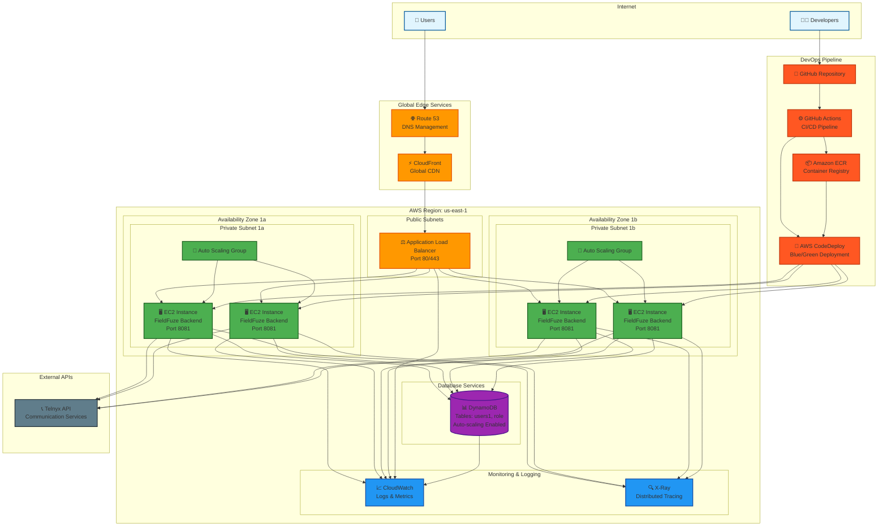

# FieldFuze Backend - AWS Architecture Diagram

This diagram shows the complete AWS architecture for the FieldFuze backend application, including CI/CD pipeline, multi-AZ deployment, and monitoring.

## Architecture Components

### 1. **Global Edge Services**
- **Route 53**: DNS management and health checks
- **CloudFront**: Global CDN for content delivery and DDoS protection

### 2. **Load Balancing & Traffic Distribution**
- **Application Load Balancer (ALB)**: 
  - Distributes incoming traffic across multiple AZs
  - Supports HTTP/HTTPS termination
  - Health checks for backend instances

### 3. **Compute Layer (Multi-AZ)**
- **Auto Scaling Groups**: 
  - Automatic scaling based on CPU/memory utilization
  - Maintains desired capacity across availability zones
- **EC2 Instances**: 
  - Run FieldFuze Backend application on port 8081
  - Deployed across us-east-1a and us-east-1b for high availability

### 4. **Database Layer**
- **DynamoDB**: 
  - NoSQL database with tables: users1, role
  - Auto-scaling enabled for read/write capacity
  - Multi-AZ replication for high availability

### 5. **Monitoring & Observability**
- **CloudWatch**: 
  - Application and infrastructure metrics
  - Log aggregation and alerting
  - Custom dashboards for system health
- **X-Ray**: 
  - Distributed tracing for request flows
  - Performance analysis and debugging

### 6. **CI/CD Pipeline**
- **GitHub**: Source code repository
- **GitHub Actions**: 
  - Automated testing and building
  - Container image creation
- **Amazon ECR**: Container registry for Docker images
- **AWS CodeDeploy**: 
  - Blue/green deployment strategy
  - Zero-downtime deployments

### 7. **External Integrations**
- **Telnyx API**: Communication services integration

## Security Features

- **VPC**: Isolated network environment
- **Private Subnets**: EC2 instances in private subnets
- **Security Groups**: Network-level access controls
- **IAM Roles**: Service-specific permissions
- **JWT Authentication**: Stateless authentication tokens
- **HTTPS/TLS**: Encrypted communication

## High Availability & Scalability

- **Multi-AZ Deployment**: Instances across multiple availability zones
- **Auto Scaling**: Automatic capacity adjustment based on demand
- **Load Balancing**: Traffic distribution across healthy instances
- **Database Replication**: DynamoDB's built-in multi-AZ replication

## Deployment Strategy

- **Blue/Green Deployment**: Zero-downtime deployments using CodeDeploy
- **Container-based**: Docker containers for consistent deployments
- **Infrastructure as Code**: Automated infrastructure provisioning
